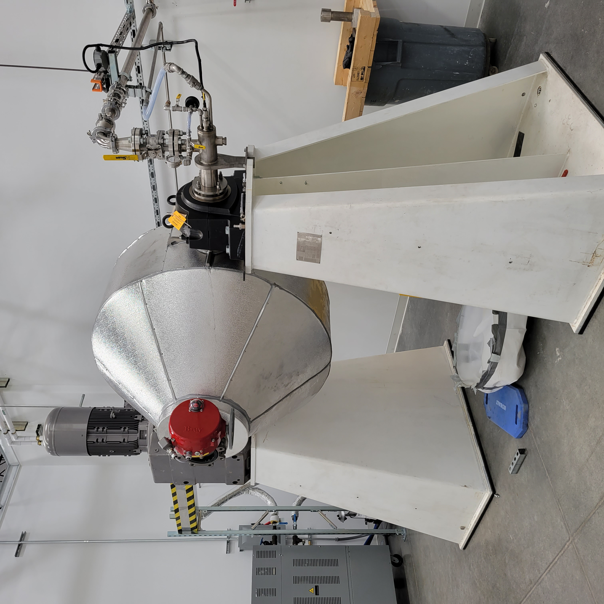

# Tumbler Oven — Industrial Machinery Reverse Engineering & Repair

> *Reverse-engineering and repair of a large industrial tumbler oven used to process powdered metal feedstock for additive manufacturing (LPBF and binder jetting), at Uniformity Labs (Fremont, CA), 2022–2023.*


*The industrial tumbler oven in the Uniformity Labs powder-processing room — a large rotating thermal system whose failure mode had to be diagnosed from physical inspection, instrumentation, and reverse-engineering rather than from a tidy service manual.*

## What this is

A documentation piece — the engineering story of diagnosing, reverse-engineering, and repairing a large industrial tumbler oven that processes powdered metal feedstock for laser powder bed fusion (LPBF) and binder-jetting additive manufacturing systems.

This work was performed during my Metal 3D Print Specialist tenure at **Uniformity Labs** in Fremont, CA (May 2022 – May 2023) — a Princeton spin-out that develops ultra-low-porosity metal powders for additive manufacturing. The tumbler oven is part of Uniformity's powder-conditioning workflow.

This repository is a **portfolio piece**, not an open hardware project. It documents the work I did from my perspective as the engineer on site, but **the equipment itself, all CAD/drawing data, and all process know-how are the proprietary property of Uniformity Labs.** See [`NOTICE.md`](NOTICE.md).

## What you will and won't find

**You will find:**

- The story of how I diagnosed the original failure mode, what I discovered when I reverse-engineered the machine's drive train and thermal control system, and what changes the repair required.
- Photos I took during the project, where they document my work and don't expose proprietary equipment internals.
- A "lessons learned" writeup — what reverse-engineering an industrial machine teaches an engineer that designing a new one from scratch doesn't.

**You will not find:**

- Uniformity Labs' proprietary CAD, drawings, control schematics, process parameters, or thermal profiles.
- Photos of internal machine components that constitute trade-secret-equivalent disclosure.
- The vendor name or model number of the original tumbler oven.


*Representative shop work from the project — a fabricated stainless-steel subassembly, welded and machined to spec, replacing a black-box component for which no original drawings were available.*

## Why this work mattered

Uniformity's value proposition is metal powders with unusually low porosity and high packing density. That advantage compounds through the powder-conditioning workflow — meaning when a piece of conditioning equipment goes down, the company's throughput drops with it. Diagnostic-and-repair work like this isn't peripheral to Uniformity's engineering; it's adjacent to the core technology.

For me as an engineer, the project was an opportunity to:
- **Reverse-engineer** mechanical drive and thermal control systems from a black-box piece of equipment.
- **Diagnose** failure modes that the original manufacturer's documentation didn't cover.
- **Coordinate** sourcing of replacement parts and engineering substitutes when originals weren't available.
- **Verify** the repaired equipment back to spec against measured powder behavior downstream.

## What I'd want a hiring manager to take from this

Tumbler ovens aren't glamorous. But the ability to walk into an industrial environment, look at a machine that has been down for a while, and methodically work through its mechanical and control systems until it's running again — and to do so without the original manufacturer's drawings — is exactly the kind of engineer most R&D groups want to hire and rarely find.

## License & rights

See [`NOTICE.md`](NOTICE.md) for the trade-secret and confidentiality scope.

The original written content, narrative, and photographs *that I have the right to publish* are released under [CC-BY 4.0](LICENSE).

## Repository structure

```
tumbler-oven/
├── README.md                  ← you are here
├── NOTICE.md                  ← Uniformity Labs IP and confidentiality scope
├── LICENSE                    ← CC-BY 4.0 (scoped to original content only)
├── .gitignore
├── narrative/                 ← the diagnostic/repair story (forthcoming)
├── photos/                    ← project photos I have the right to publish
└── reflections/               ← lessons learned (forthcoming)
```

## Status

| Section | Status |
|---|---|
| Repo description, license, NOTICE, gitignore | ✓ done |
| Diagnostic narrative | forthcoming |
| Repair narrative | forthcoming |
| Lessons learned | forthcoming |
| Curated photos | forthcoming (from `additive-manufacturing/industrial-oven/`) |
